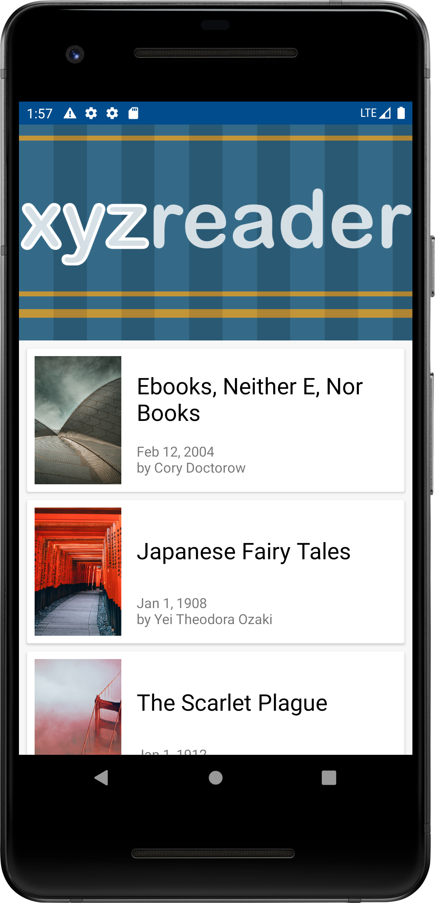
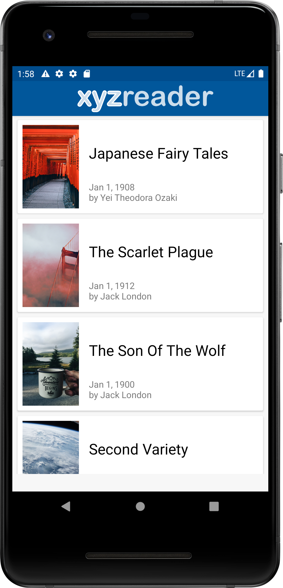
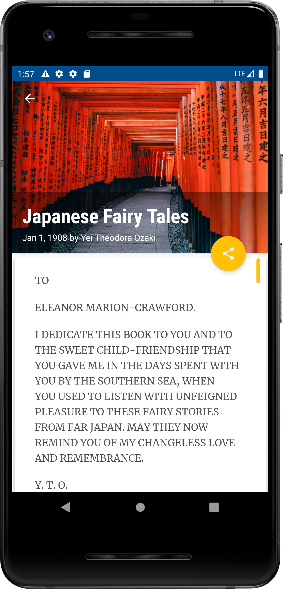
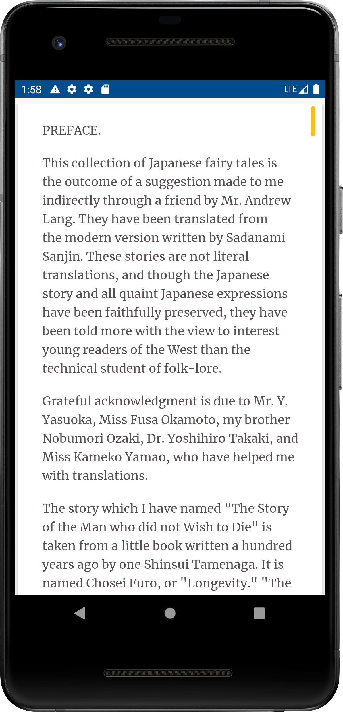

# XYZReader

Project to update the look and feel of an app to meet Material Design specifications. 
Part of Udacity Android Developer Nanodegree course  

## Overview
* Redesign provided reader app to improve the UI and to conform to Material Design.
* App implements Material Design Components: 
   + CoordinatorLayout 
   + AppBarLayout
   + CollapsingToolbarLayout
   + SnackBar
* Use paper surfaces in the design
* Apply transitions and motion 
   

 

 

   
 
 
 
 
